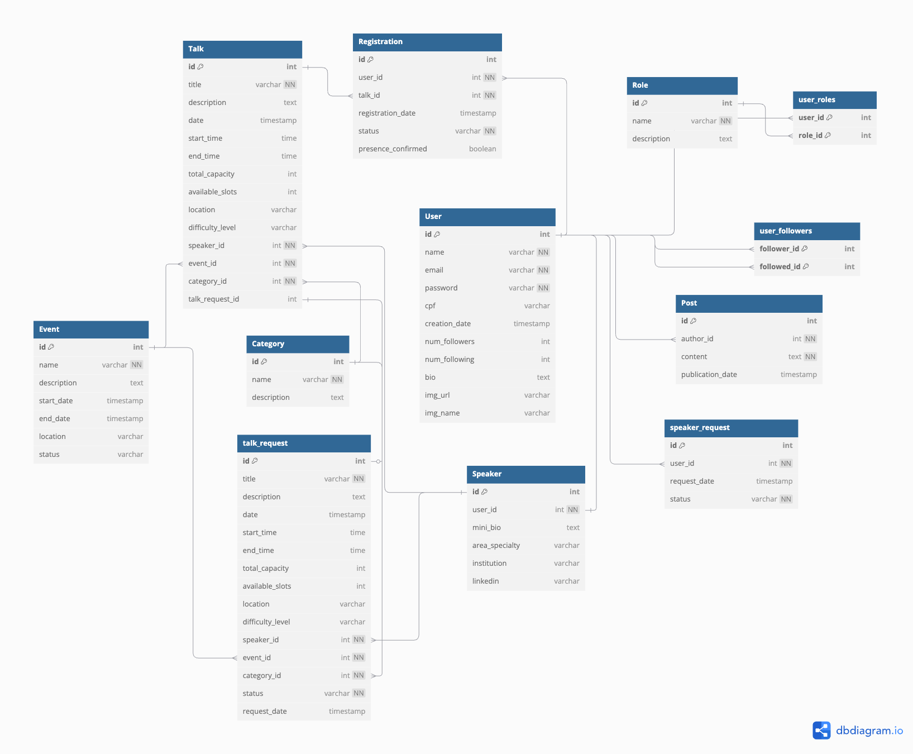

# 🎙️ TalkHub

Uma plataforma completa para gerenciamento e participação em palestras e eventos. Ideal para universidades, conferências, meetups e eventos online. Crie, organize, participe e interaja com outros participantes.

## 🌟 Sobre o Projeto
O TalkHub é uma plataforma inovadora que combina o melhor dos dois mundos: gerenciamento profissional de eventos e networking social. Nossa missão é conectar palestrantes, organizadores e participantes em um ecossistema dinâmico e colaborativo.

## 🎯 Objetivo Principal

Este projeto foi desenvolvido como uma iniciativa pessoal para aprofundar conhecimentos em Java e Spring Framework, com foco especial em Spring Security para implementação robusta de autenticação, autorização e controle de acesso.

## 🛠️ Tecnologias

- Java 21
- Spring Boot
- Spring Security
- Autenticação JWT
- Spring Data JPA (Hibernate)
- PostgreSQL
- Docker + Docker Compose
- (Em breve: Integração com Google Calendar API e sistema de certificados)
- (Em breve: utilização da amazon S3)

## Documentação da API

Esta documentação descreve todos os endpoints disponíveis na API, organizados por funcionalidade.

## 📋 Índice

- [👤 Usuários](#-usuários)
- [🎙️ Solicitação de Permissão para Palestrante](#️-solicitação-de-permissão-para-palestrante)
- [📝 Solicitações de Palestras](#-solicitações-de-palestras)
- [🎤 Palestras](#-palestras)
- [🏷️ Categorias](#️-categorias)
- [📅 Eventos](#-eventos)
- [✍️ Inscrições em Palestras](#️-inscrições-em-palestras)
- [📱 Posts e Feed](#-posts-e-feed)

---

## 👤 Usuários

<strong>Clique para ver os endpoints de usuários</strong>

### Gerenciamento de Conta

| Método | Endpoint | Descrição | Permissão |
|--------|----------|-----------|-----------|
| `POST` | `/user` | Criar conta | Público |
| `GET` | `/users/me` | Acessar próprio perfil | ROLE_USER |
| `PUT` | `/users/me` | Atualizar dados próprios | ADMIN e Próprio Usuário |
| `DELETE` | `/users/me` | Deletar própria conta | ROLE_USER |

### Visualização de Perfis

| Método | Endpoint | Descrição | Permissão |
|--------|----------|-----------|-----------|
| `GET` | `/users/{userId}/profile/` | Ver detalhes de um usuário | ROLE_USER |
| `DELETE` | `/users/{userId}` | Deletar usuário | ADMIN |

### Sistema de Seguidores

| Método | Endpoint | Descrição | Permissão |
|--------|----------|-----------|-----------|
| `POST` | `/users/{userId}/follow` | Seguir outro usuário | Próprio usuário |
| `DELETE` | `/users/{userId}/unfollow` | Deixar de seguir usuário | Próprio usuário |
| `GET` | `/users/{userId}/followers` | Listar seguidores de um usuário | ROLE_USER, ADMIN |
| `GET` | `/users/me/following` | Listar quem o usuário logado segue | Próprio usuário |
| `GET` | `/users/me/followers` | Listar seguidores do usuário logado | Próprio usuário |

---

## 🎙️ Solicitação de Permissão para Palestrante

<strong>Clique para ver os endpoints de solicitações para palestrante</strong>

### Solicitações

| Método | Endpoint | Descrição | Permissão |
|--------|----------|-----------|-----------|
| `POST` | `/speaker-request` | Solicitar para virar palestrante | Usuário logado |
| `GET` | `/speaker-request` | Listar todas as solicitações | ADMIN |
| `PATCH` | `/speaker-request/{id}/approve` | Aprovar solicitação | ADMIN |
| `PATCH` | `/speaker-request/{id}/reject` | Rejeitar solicitação | ADMIN |

### Gerenciamento de Palestrantes

| Método | Endpoint | Descrição | Permissão |
|--------|----------|-----------|-----------|
| `PUT` | `/speaker` | Preencher dados adicionais do palestrante | ROLE_SPEAKER |
| `GET` | `/speaker/list` | Listar todos os palestrantes | ADMIN |

> **Nota:** Os endpoints manipulam a entidade `SpeakerRequest`, que está ligada ao `User`. Dados adicionais incluem bio, área de atuação, links, etc.

---

## 📝 Solicitações de Palestras

<strong>Clique para ver os endpoints de solicitações de palestras</strong>

| Método | Endpoint | Descrição | Permissão |
|--------|----------|-----------|-----------|
| `POST` | `/talk-requests` | Criar solicitação de palestra | ROLE_SPEAKER |
| `GET` | `/talk-requests/pending` | Listar solicitações pendentes | ADMIN |
| `POST` | `/talk-requests/{id}/approve` | Aprovar uma solicitação | ADMIN |
| `POST` | `/talk-requests/{id}/denied` | Rejeitar uma solicitação | ADMIN|

### Fluxo de Aprovação

1. **Criação**: Palestrante submete título, descrição, evento e categoria
2. **Status inicial**: `PENDING`
3. **Aprovação**: Admin aprova e cria uma `Talk` baseada na `TalkRequest`
4. **Rejeição**: Admin rejeita com motivo opcional

> **Importante:** `TalkRequest` é apenas um esboço da palestra. A entidade `Talk` só é criada após aprovação administrativa.

---

## 🎤 Palestras

<strong>Clique para ver os endpoints de palestras</strong>

| Método | Endpoint | Descrição | Permissão |
|--------|----------|-----------|-----------|
| `GET` | `/talks/{talkId}` | Ver detalhes da palestra | Público |
| `PATCH` | `/talks/{talkId}` | Atualizar palestra | Criador ou ADMIN |
| `DELETE` | `/talks/{talkId}` | Deletar palestra | Criador ou ADMIN |

> **Validação para exclusão:** Palestras só podem ser deletadas se não estiverem vinculadas a inscrições ou eventos em andamento.

---

## 🏷️ Categorias

<strong>Clique para ver os endpoints de categorias</strong>

| Método | Endpoint | Descrição | Permissão |
|--------|----------|-----------|-----------|
| `POST` | `/category` | Criar uma categoria | ADMIN |
| `GET` | `/category/list` | Listar todas as categorias | Público |
| `DELETE` | `/category/{categoryId}` | Deletar categoria | ADMIN |
| `GET` | `/category/{categoryId}/talks` | Listar palestras de uma categoria | Público |

> **Nota:** A exclusão de categorias com palestras associadas está em desenvolvimento para implementar validações adequadas.

---

## 📅 Eventos

<strong>Clique para ver os endpoints de eventos</strong>

| Método | Endpoint | Descrição | Permissão |
|--------|----------|-----------|-----------|
| `POST` | `/events` | Criar evento | ADMIN |
| `GET` | `/events/{eventId}` | Ver detalhes do evento | Público |
| `GET` | `/events` | Listar todos os eventos | Público |

> **Nota:** O back-end retorna automaticamente os dados das palestras relacionadas ao evento nas consultas de detalhes.

---

## ✍️ Inscrições em Palestras

<strong>Clique para ver os endpoints de inscrições</strong>

### Gerenciamento de Inscrições

| Método | Endpoint | Descrição | Permissão |
|--------|----------|-----------|-----------|
| `POST` | `/talks/{talkId}/register` | Inscrever-se em palestra | ROLE_USER |
| `DELETE` | `/registrations/{registerId}/unregister` | Cancelar inscrição | Próprio usuário |
| `PATCH` | `/registrations/{registerId}/confirm` | Confirmar presença | Próprio usuário |

### Consultas

| Método | Endpoint | Descrição | Permissão |
|--------|----------|-----------|-----------|
| `GET` | `/registrations/{registerId}` | Ver detalhes da inscrição | Próprio usuário |
| `GET` | `/users/{userId}/registrations` | Listar inscrições de um usuário | Próprio usuário e ADMIN |

> **Importante:** O cancelamento de inscrição não remove o registro do banco de dados, mantendo o histórico para relatórios e controles internos.

---

## 📱 Posts e Feed

<strong>Clique para ver os endpoints de posts e feed</strong>

| Método | Endpoint | Descrição | Permissão |
|--------|----------|-----------|-----------|
| `POST` | `/feed` | Criar post | Usuário logado |
| `GET` | `/feed` | Visualizar feed principal | ROLE_USER, ADMIN, Palestrante |
| `GET` | `/users/{userId}/posts` | Listar posts de usuário específico | ROLE_USER |
| `DELETE` | `/users/me/posts/{postId}` | Apagar post | Dono ou Admin |

### Características do Feed

- **Ordenação**: Posts são exibidos do mais recente para o mais antigo
- **Conteúdo**: Mostra posts de usuários diversos de forma aleatória
- **Acesso**: Disponível para usuários autenticados com diferentes roles

---

## 🔐 Níveis de Permissão

- **Público**: Sem necessidade de autenticação
- **ROLE_USER**: Usuário comum autenticado
- **ROLE_SPEAKER**: Usuário com permissão especial para dar palestras
- **ROLE_ADMIN**: Administrador do sistema
- **Próprio usuário**: Ações que só podem ser realizadas pelo dono do recurso

---

## Modelagem das entidades

---

## 📦 Como Rodar Localmente

<ol>
    <li>Clone o repositório: git clone https://github.com/Filipe-Samuel-p/TalkHub.git</li>
    <li>cd TalkHub</li>
    <li>Configure o banco PostgreSQL (Usando Docker): docker-compose up --build</li>
    <li>Execute a aplicação: ./mvnw spring-boot:run OU Execute utilizando um editor de código como o Intellij Idea</li>
</ol>

